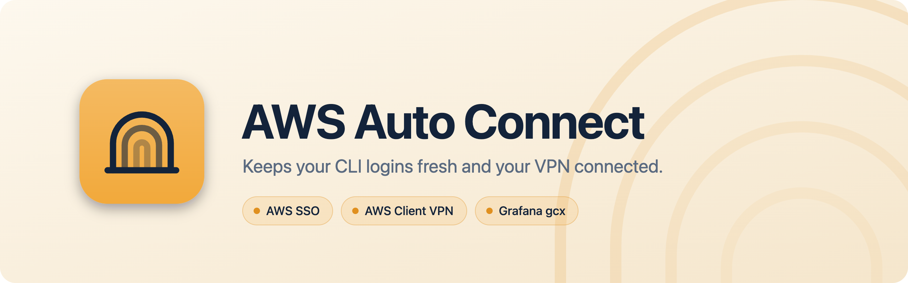

<picture>
  <source media="(prefers-color-scheme: dark)" srcset="Assets/banner-dark.png">
  
</picture>

Menu bar app that keeps your CLI logins fresh and your VPN connected, without clicking through browser
pages: AWS SSO, AWS Client VPN (SAML), and Grafana's `gcx`. Sign-in goes through your identity provider
(Google by default) in a hidden browser that only shows itself when you really need to sign in.

- Native Swift, ~5 MB, no runtime dependencies. Uses the system WebKit as the hidden browser.
- Lives only in the menu bar: click the tunnel icon for status and actions; **Settings** (⌘,) slides
  in the rest, with a tab per connector. The icon is dimmed when nothing is connected and gets a dot only while
  something is working (yellow) or needs you (red).
- Pluggable: sign-in providers are JSON, connectors are small Swift adapters
  ([CONTRIBUTING.md](CONTRIBUTING.md)).

## Install

With Homebrew (builds from source; needs the Xcode Command Line Tools: `xcode-select --install`):

```bash
brew install alexdevlabs/tap/aws-autoconnect
open "$(brew --prefix aws-autoconnect)/AWS AutoConnect.app"
```

On first start it copies itself to `/Applications` (or `~/Applications` if you can't write there) and
runs from there, so it's in Finder, Spotlight and Launchpad. After `brew upgrade` the copy updates itself the next time it starts.

**Updates:** once a day the app checks GitHub for a newer release. The panel then shows **v… is ready**
with **Notes** and **Update**. Update runs `brew update` and `brew upgrade aws-autoconnect`, restarts the app
and reconnects the VPN if it was up. **Settings** ▸ **General** ▸ **Updates** can turn the check off, check now, or
install updates on their own while the VPN is off. Copies installed with `make install` or
`brew install --HEAD` only get the notice.

Or from a clone:

```bash
make install   # builds patched openvpn (first time), the app, copies to /Applications
open /Applications/"AWS AutoConnect.app"
```

Needs macOS 14+, the Xcode Command Line Tools 16+ (Swift 6) and Homebrew `openssl@3`.

## First-time setup

1. **Settings** ▸ **SSO** ▸ **Browser**: pick your provider, then **Sign in to …** once. Cookies are kept in the
   app's WebKit store.
2. **Settings** ▸ **VPN** ▸ pick the AWS VPN Client profile ▸ **Install Helper…** (asks for your admin password once).
3. In the panel, **Connect** on the AWS Client VPN row.
4. Optional: **Settings** ▸ **General** ▸ **Connectors** ▸ turn on **Grafana (gcx)**, then set it up on its page. It
   only shows up when `gcx` is installed (Homebrew, `~/go/bin`, `~/.local/bin`, or mise/asdf shims).

## Connectors

| Connector | Keeps | How |
|---|---|---|
| **AWS SSO** | an `sso-session` from `~/.aws/config` | Every minute it reads the CLI's token cache. Near expiry it runs `aws configure export-credentials` (silent refresh). If that isn't enough, it runs `aws sso login` and the hidden browser clicks "Confirm and continue" / "Allow access". |
| **AWS Client VPN** | a tunnel from an AWS VPN Client profile | SAML sign-in in the hidden browser, then the root helper starts the patched openvpn. Optional reconnect after drops and wake. Quitting the app closes the tunnel. Owns the DNS relay below. |
| **Grafana (gcx)** | the `gcx` CLI login | Every few minutes it runs `gcx api /api/user`. When that's rejected it runs `gcx auth login` and presses OK on Grafana's page. Can wait for the VPN if your stack is behind it. |

Connectors are stored as a list (`ConnectorStore`), so several of a type are possible later. The panel
and Settings show the first enabled one of each.

## Sign-in providers

Google is built in. **Other (generic)** works with any provider without clicking anything on its
pages: a visible password box means you need to sign in. Add your own (Okta, Microsoft Entra,
Keycloak, …) as JSON files in `~/Library/Application Support/AWSAutoConnect/providers/`; see
[CONTRIBUTING.md](CONTRIBUTING.md#adding-a-sign-in-provider).

When the provider wants you (signed out, 2-step, passkey, "Verify it's you"), you get a notification,
the dot turns red, and the panel shows **… wants you to sign in** with a **Sign In…** button. The flow waits up
to 10 minutes, then carries on and the window hides again.

## How the VPN works

AWS Client VPN is OpenVPN with a SAML extension.
1. openvpn (as you) connects with `ACS::35001` and gets `AUTH_FAILED,CRV1:…:<sid>:…:<saml url>`.
2. The hidden browser opens the URL; the provider posts `SAMLResponse` to `127.0.0.1:35001`, where the app listens.
3. `sudo -n vpn-helper connect …` starts openvpn as root with `CRV1::<sid>::<SAMLResponse>`.

**DNS**: while the tunnel is up, macOS uses `dns-relay` on 127.0.0.1 (root, from the helper):
- **Allowlist only off** (default): every lookup goes to the VPN's resolver and to your network's at
  the same time. Answers come from the VPN's, like the AWS client; your network's is only used if the
  VPN's fails or takes over 1.5 s.
- **Allowlist only on**: allowlisted domains (and their subdomains) work the same way. Every other
  name goes to your network's resolver only, and to the VPN's only when yours doesn't know the name
  or fails, so the VPN's resolver doesn't see the rest.
- Either way it records names that need the VPN: an answer points inside the pushed routes, or only
  the VPN's resolver knows the name. **Settings** ▸ **DNS** lists them grouped by domain: allow a name, its `*.parent` or the whole
  group, and remove them again from **Allowed**. **Allowed** also takes hostnames you add yourself
  (one at a time, or all at once with **Edit as Text…**, which also copies out the list), and **Scan Config Files** looks up the hosts in `~/.ssh/config`, `~/.kube/config` and
  `~/.aws/config` while connected. Stored in `~/Library/Application Support/AWSAutoConnect/vpn-domains.json`;
  only names that needed the VPN, never other lookups.
- `dns.sh watch` restarts the relay if it exits, puts DNS back when DHCP or a network switch
  overwrites it, and restores your DNS if openvpn dies. Without the relay, DNS points straight at the
  VPN's resolver.

openvpn 2.6.12 + the AWS SAML patch from [aws-vpn-client/aws-vpn-client](https://github.com/aws-vpn-client/aws-vpn-client)
(the maintained home of the archived samm-git/aws-vpn-client), downloaded by `scripts/build-openvpn.sh`
at a pinned commit and SHA-256. On top of it, `vendor/openvpn-aws-size-macros.patch` wraps the patch's
size macros in parentheses (without it openvpn exits with "fatal buffer size error"). OpenSSL is linked
statically.

## What the helper installs (root)

| Path | What |
|---|---|
| `/usr/local/libexec/aws-autoconnect/` | `openvpn`, `dns-relay`, `vpn-helper`, `dns.sh` |
| `/usr/local/etc/aws-autoconnect/` | sanitised profile (no `up`/`down`/scripts), endpoint, profile name |
| `/etc/sudoers.d/aws-autoconnect` | `<you> ALL=(root) NOPASSWD: …/vpn-helper` |
| `/var/log/aws-autoconnect.log`, `aws-autoconnect-dns.log` | openvpn log, DNS relay log |
| `/var/run/aws-autoconnect/` | pid, relay config, allowlist, `dns-learned.log` (gone after reboot) |

`vpn-helper` only accepts `connect <ipv4> <port> <udp|tcp> <file>`, `disconnect`, `status` and
`dns-config <file>`, and reads the credentials and allowlist files as you, not as root. The AWS Client VPN
page's **Uninstall…** removes all of it. More in [SECURITY.md](SECURITY.md).

## Logs

Something not working? Open **Settings ▸ General ▸ Logs** and click **Save as Zip**: it puts the logs
in your Downloads folder, ready to attach to an issue. Tokens, keys, codes and email addresses are
masked. Snapshots of stuck sign-in pages stay out of the zip, since a picture can't be masked; attach
`AWSAutoConnect-stuck.png` yourself (⋯ ▸ Show in Finder) if you're happy to share it. ⋯ ▸ **Clear Logs…**
deletes the app's logs.

- App: `~/Library/Logs/AWSAutoConnect.log`, with every sign-in step: the command's output, each page the
  hidden browser loads, what it clicked or why it's waiting (e.g. no button matched), and each check that
  failed. A sign-in that gives up logs the page it was stuck on and saves `AWSAutoConnect-stuck.png` next
  to it. Past 2 MB it starts over, keeping the previous file as `AWSAutoConnect.old.log`.
- Tunnel: `/var/log/aws-autoconnect.log`
- DNS relay: `/var/log/aws-autoconnect-dns.log`

## License

MIT, see [LICENSE](LICENSE). The bundled openvpn is GPLv2; it's downloaded and built at install time,
not stored in this repository.
